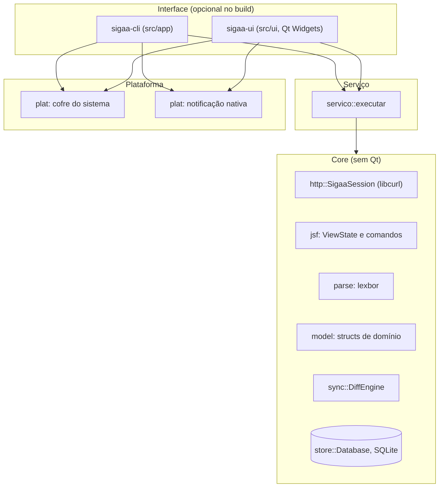
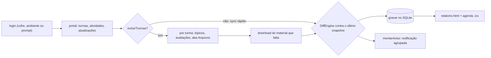
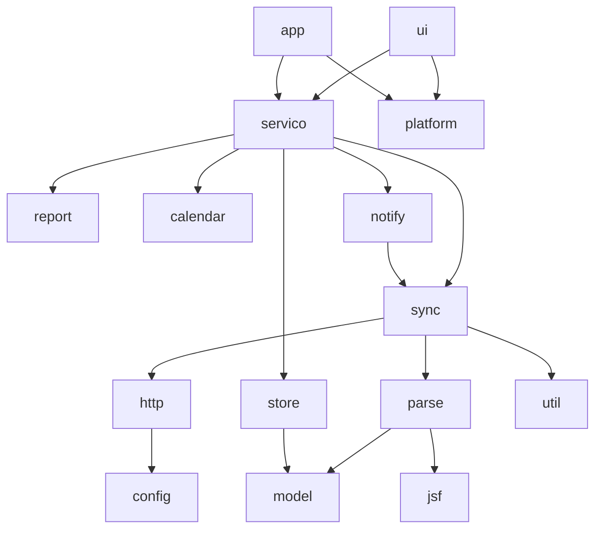
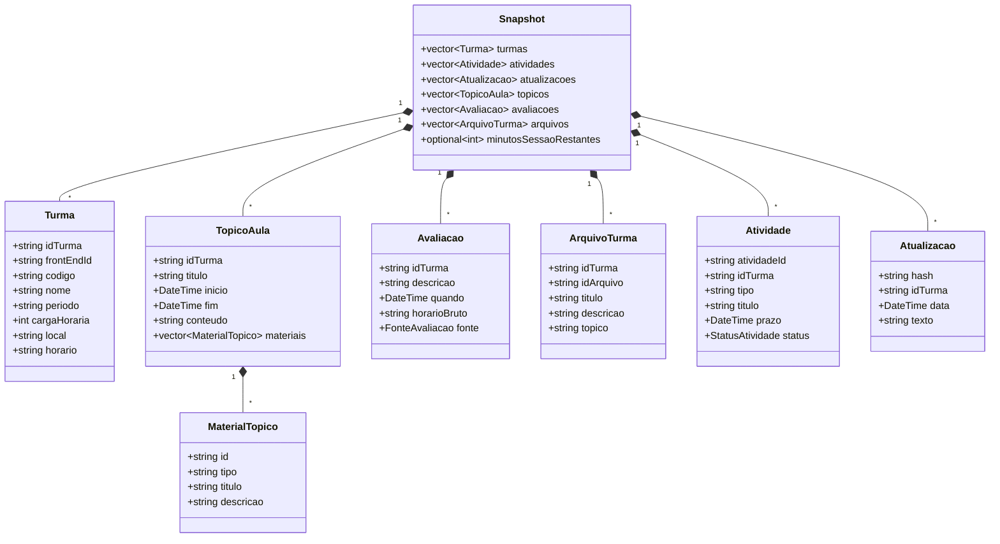

# Arquitetura

O **SIGAA Desktop Viewer** separa responsabilidades em camadas com uma regra de
ouro: `src/core/` não conhece framework de interface nenhum. É isso que mantém o
núcleo testável sem display, e o que permite compilar só a CLI
(`-DSIGAA_UI=OFF`) sem tocar em nada do core.

## Estrutura de diretórios

```text
src/
  app/         Ponto de entrada da CLI (main.cpp com os subcomandos)
  core/
    calendar/  Aulas do dia, merge de avaliações, geração de iCal (Calendario)
    config/    Catálogo de instituições e host selecionado (Instituicao)
    http/      Sessão HTTP com o SIGAA via libcurl (SigaaSession, Response)
    jsf/       Motor JSF/RichFaces: formulários, ViewState, comandos (JsfForm)
    model/     Structs de domínio (Models.h)
    notify/    Política de aviso: agrupa e prioriza eventos do diff (Aviso)
    parse/     Parsing de HTML com lexbor (Html, PortalParser, TurmaParser)
    report/    Relatório HTML do snapshot (HtmlReport)
    servico/   Orquestração do ciclo completo (Servico)
    store/     Persistência em SQLite, migração e UPSERT (Database)
    sync/      Coleta e diff (Crawler, DiffEngine, Materiais, Baixador)
    util/      Caminhos UTF-8 seguros no Windows (Caminho)
  platform/    Cofre de credenciais e notificação nativa (Credenciais, Notify)
  ui/          Interface Qt Widgets (JanelaPrincipal, JanelaTurma, Modelos, ...)
    forms/     Arquivos .ui do Qt Designer, consumidos via AUTOUIC
    recursos/  Stylesheet QSS e ícones SVG monocromáticos
tests/         Suíte Catch2 v3 (tests/<modulo>_test.cpp)
tools/         redact.py, empacotar.ps1, agendar.ps1, gerar_icone.py
docs/          RECON.md (engenharia reversa verificada), PLANO.md
```

Para as assinaturas públicas de cada módulo, veja [[Referencia-da-API]].

## Diagramas

### 1. Camadas



Repare que `plat::` é chamado pela interface, não pelo serviço: o serviço não
pergunta credenciais e não notifica. Ele devolve o aviso pronto e quem chamou
decide o que fazer com ele.

### 2. Pipeline de sincronização



O sync rápido (só portal) é o ciclo de 20 minutos; o completo, com turmas, roda
a cada 6 horas na interface. Por isso a coleta é **parcial por natureza**, e daí
vem a regra mais importante do banco: coleta parcial nunca apaga o que ela não
trouxe.

### 3. Dependência entre módulos



### 4. Modelo de domínio

Todas as structs vivem em `src/core/model/Models.h` e são agregadas por
`Snapshot`, que é a unidade de um ciclo de coleta.



Dois detalhes que economizam depuração:

*   `frontEndId` (hash de 40 hex) é o **único** jeito de entrar na turma
    virtual. `idTurma` serve para atualizações e chat, e não substitui o outro.
*   `MaterialTopico::id` e `ArquivoTurma::idArquivo` são a mesma chave: o
    parâmetro `id` avulso do `jsfcljs`. É o que permite saber que um material de
    tópico é baixável, em vez de adivinhar pelo ícone.

## Decisões de projeto

*   **Core sem framework de interface.** `src/core/` não inclui Qt. Integração
    com o sistema operacional fica em `src/platform/`; Qt fica confinado em
    `src/ui/`. A interface é opcional no build, e o core roda em CI sem display.
*   **Offline-first de verdade.** A tela lê do SQLite. Depois de um sync só de
    portal, o app relê do banco antes de pintar: o snapshot da coleta não tem
    avaliações, e mostrá-lo direto apagaria as provas do aluno.
*   **Coleta parcial nunca apaga.** O `Database` faz UPSERT e não deleta o que a
    coleta não trouxe. Pela mesma razão, o `DiffEngine` ignora avaliações,
    arquivos e tópicos quando o vetor correspondente vem vazio.
*   **Paralelismo por sessão, nunca dentro de uma.** O SIGAA guarda a view no
    servidor: duas navegações simultâneas no mesmo `JSESSIONID` invalidam o
    estado, e o download volta como página de erro salva com extensão `.pdf`. O
    `Baixador` paraleliza abrindo uma sessão por canal, com login próprio, com
    teto de 3.
*   **Navegação por rótulo, não por id de componente.** Ids como
    `formMenu:j_id_jsp_719010821_123` são posicionais e mudam quando a
    instituição recompila o JSP. O SIGAA responde 200 com a aba errada, sem erro
    nenhum. `jsf::findCommandByLabel` existe para isso.
*   **Host do SIGAA é parâmetro e entra na chave do cofre.** Cravar
    `sigaa.unifei.edu.br` faz trocar de instituição tentar a senha de uma
    universidade na outra, e algumas tentativas erradas bloqueiam a conta.
*   **Credenciais.** Login e senha vão juntos num blob cifrado do cofre do
    sistema; o CPF não fica no campo de usuário, que é legível. Senha nunca em
    `argv`, porque fica no histórico do shell. Nada é gravado no cofre antes de
    validar no SIGAA.
*   **Tema sem cor literal.** O `estilo.qss` só usa `palette(...)`, e os ícones
    são SVG monocromático repintado em runtime. Um `#f5f5f5` cravado vira texto
    branco sobre branco quando o Windows entra no tema escuro.
*   **Layout no Qt Designer.** Os `.ui` em `src/ui/forms/` são a fonte do
    layout, consumidos por AUTOUIC. Fica em código só o que o Designer não
    alcança.
*   **Idioma único.** As strings estão fixadas em português: o público-alvo é
    uma universidade. Internacionalização está no [[Roadmap]].
