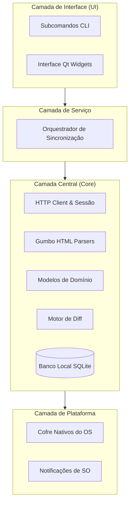
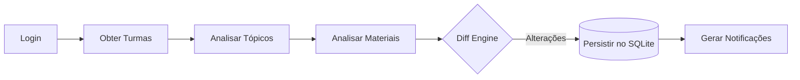
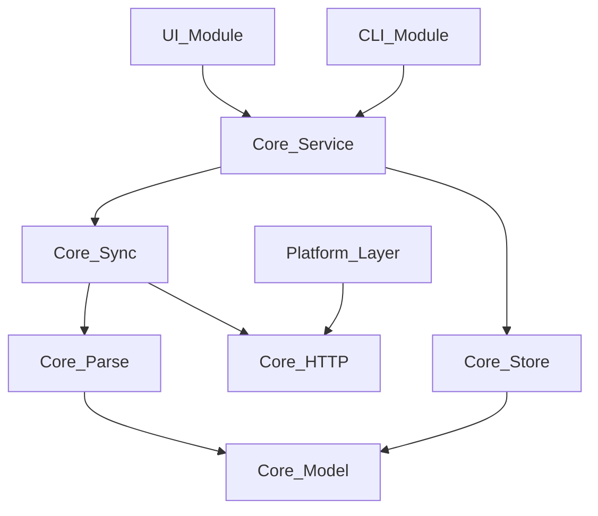
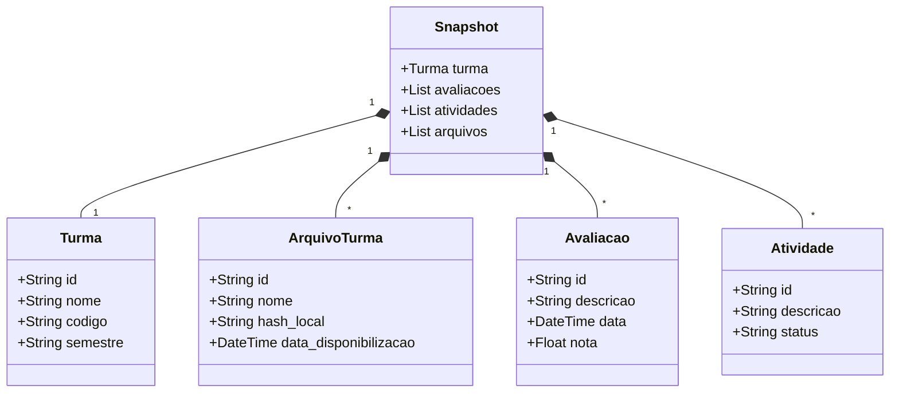

# Arquitetura

O **SIGAA Desktop Viewer** é estruturado com uma separação clara de responsabilidades, visando robustez, manutenção simplificada e resiliência a mudanças no HTML do SIGAA web.

## Estrutura de Diretórios

Abaixo está o mapeamento dos principais módulos dentro do projeto:

```text
src/
  app/         → Ponto de entrada da CLI (main.cpp com subcomandos: sync, login, logout, doctor, arquivos, baixar, explorar)
  core/
    calendar/  → Detecção de semestre, feriados, exportação iCal (Calendario)
    config/    → Suporte a múltiplas instituições (Instituicao - UNIFEI padrão)
    http/      → Sessão HTTP com o SIGAA (SigaaSession - URL base dinâmica, download de arquivos, ViewState)
    jsf/       → Tratamento de protocolo JSF/RichFaces
    model/     → Structs de domínio (Turma, Snapshot, ArquivoTurma, Avaliacao, Atividade)
    notify/    → Notificações desktop (Aviso - agrupadas, priorizadas)
    parse/     → Parsing HTML via Gumbo (Html, TurmaParser - tópicos, materiais, notas)
    report/    → Geração de relatórios HTML/iCal
    servico/   → Orquestração de serviços (Servico - fluxo completo de sincronização)
    store/     → Persistência em SQLite (Database - migração de schema, UPSERT)
    sync/      → Crawling e detecção de diferenças (Crawler, DiffEngine, Materiais, Baixador)
    util/      → Utilitários cross-platform para caminhos UTF-8 (Caminho)
  platform/    → Cofres de credenciais nativos do SO (Windows Credential Manager, libsecret)
  ui/          → Interface GUI Qt Widgets (JanelaPrincipal, JanelaTurma, DialogoLogin, Modelos)
    forms/     → Arquivos .ui criados no Qt Designer
    recursos/  → Stylesheet QSS e ícones (SVG monocromáticos, tingidos em runtime)
tests/         → Suítes de teste baseadas em Google Test
tools/         → Scripts de build/empacotamento (empacotar.ps1)
docs/          → RECON.md (engenharia reversa), PLANO.md
```

## Diagramas Arquiteturais

### 1. Arquitetura em Camadas



### 2. Pipeline de Sincronização



### 3. Grafo de Dependência de Módulos (Simplificado)



### 4. Diagrama de Classes do Domínio (Chave)



## Decisões de Design (ADRs)

*   **Offline-first**: O aplicativo carrega primeiramente do cache SQLite antes de tentar requisições na rede.
*   **Sessões HTTP Isoladas**: As instâncias de `JanelaTurma` usam `SigaaSession` de forma independente. Isso previne o notório conflito de *ViewState* no protocolo JSF.
*   **Design Responsivo e Temas**: Nenhum literal de cor no QSS; utiliza-se exclusivamente os objetos da `palette()` do Qt, permitindo um suporte fluido a temas Dark/Light nativos.
*   **Gestão de Ícones**: Todos os ícones são em SVG monocromático e manipulados (re-tinted) em tempo de execução para acompanhar mudanças no tema atual.
*   **Segurança de Credenciais**: O CPF e a senha não ficam salvos em plain-text. O CPF é criptografado juntamente em um blob, sem popular os campos de usuário para leitura direta. Senhas *nunca* são aceitas pela `argv` da CLI.
*   **Proteção de Infraestrutura**: O limite de concorrência em downloads simultâneos é *fixado* em 3, balanceando a memória e evitando punições pelo WAF. O protocolo do SIGAA permite apenas 1 requisição em andamento por `JSESSIONID`.
*   **Internacionalização (i18n)**: Hard-coded string bindings restritos a Português (público alvo é single-university).
