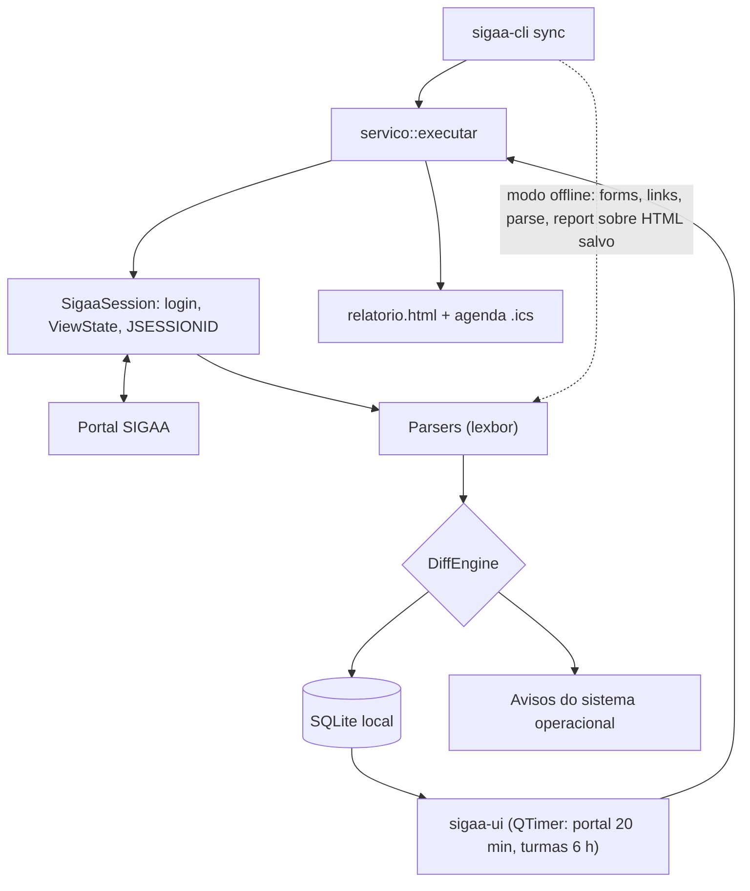

# SIGAA Desktop Viewer

Wiki do projeto **SIGAA Desktop Viewer**.

## Visão geral

O **SIGAA Desktop Viewer** é um cliente desktop em C++20 que lê o SIGAA e guarda
o resultado num banco local. Ele nasceu para a UNIFEI, mas o host do SIGAA é
parâmetro (`--url`), então outras instituições podem ser apontadas por conta e
risco: só a UNIFEI foi verificada contra o site real.

A ideia central é **offline-first**: a tela lê do SQLite, não da rede. Uma
sincronização só vai ao SIGAA para atualizar o banco, e o app continua útil
quando o portal está fora do ar.

### Principais funcionalidades

*   **Painel offline**: turmas, provas, tópicos de aula e atualizações lidos do banco.
*   **Rastreamento de avaliações**: provas do painel de avaliações e as inferidas dos tópicos de aula, com exportação em iCal.
*   **Download de materiais**: baixa o material publicado pelo professor, com cache por id do SIGAA.
*   **Notificações do sistema**: avisos agrupados e priorizados sobre material e prazos novos.
*   **CLI completa**: tudo que a interface faz, mais os subcomandos de engenharia reversa.

## Tecnologias

HTTP com libcurl, parsing de HTML com lexbor, testes com Catch2 v3.

## Fluxo de dados

O diagrama abaixo mostra o caminho da informação e, principalmente, os **dois
pontos de entrada**: a interface gráfica e a CLI. Os dois chamam o mesmo
`servico::executar`, e a GUI é opcional no build (`-DSIGAA_UI=OFF` compila só o
`sigaa-cli`).

Duas leituras valem a pena:

*   **Só CLI**: `sigaa-cli sync` faz o ciclo inteiro e entrega relatório HTML e
    `.ics` sem nunca abrir a interface. Serve para quem prefere terminal e para
    execução agendada (`--quiet`).
*   **Só banco**: a seta que chega na GUI parte do SQLite, não da rede. A tela
    nunca pinta o snapshot da coleta direto, porque uma coleta parcial não traz
    tudo; quem acumula as coletas numa foto completa é o banco.

## Navegação

*   [[Arquitetura]]: estrutura de diretórios, camadas, pipeline de sync, modelo de domínio e decisões de projeto.
*   [[Referencia-da-API]]: assinaturas públicas do core, módulo por módulo, para quem quer reaproveitar as peças.
*   [[Configuracao-e-Build]]: pré-requisitos, compilação no Windows e no Linux, credenciais e empacotamento.
*   [[Contribuindo]]: workflow de PR, commits, estilo de código, testes, segurança e etiqueta com o servidor.
*   [[Protocolo-SIGAA]]: referência de JSF/RichFaces, ViewState, login, download e as armadilhas conhecidas.
*   [[Roadmap]]: o que já existe, o que falta e por onde começar a contribuir.
