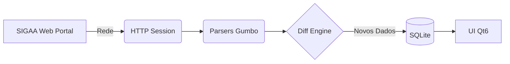

# SIGAA Desktop Viewer

Bem-vindo à wiki do projeto **SIGAA Desktop Viewer**!

## Visão Geral do Projeto

O **SIGAA Desktop Viewer** é um aplicativo desktop (escrito em C++20 com Qt6) projetado para alunos da UNIFEI. Ele funciona como um **painel acadêmico offline-first**, permitindo visualizar dados do SIGAA sem depender constantemente da instabilidade ou indisponibilidade do sistema web.

### Principais Funcionalidades

*   **Dashboard Offline-First**: Acesse suas notas, frequências e avisos a qualquer momento.
*   **Rastreamento de Avaliações**: Acompanhe provas e trabalhos em um só lugar.
*   **Download Automático de Materiais**: Baixe materiais de aula sincronizados localmente.
*   **Notificações Desktop**: Receba alertas consolidados sobre novos materiais e avisos.

## Tecnologias e Construção

## Fluxo de Dados

Abaixo está o diagrama de fluxo de dados de alto nível da aplicação, mostrando como as informações saem do portal web e chegam na interface do usuário:

## Navegação Rápida

Explore as páginas da wiki para entender mais sobre o funcionamento interno e como contribuir:

*   [[Arquitetura]] — Estrutura de diretórios, diagramas de camadas, pipeline de sync e decisões de design.
*   [[Configuracao-e-Build]] — Pré-requisitos, compilação (Windows/Linux), configuração de ambiente e empacotamento.
*   [[Contribuindo]] — Guia para contribuidores: workflow, commits, estilo de código, testes, segurança e etiqueta com o servidor.
*   [[Protocolo-SIGAA]] — Referência técnica do protocolo JSF/RichFaces, ViewState, fluxo de login e download.
*   [[Roadmap]] — Funcionalidades implementadas, planejadas e como contribuir com cada uma.
