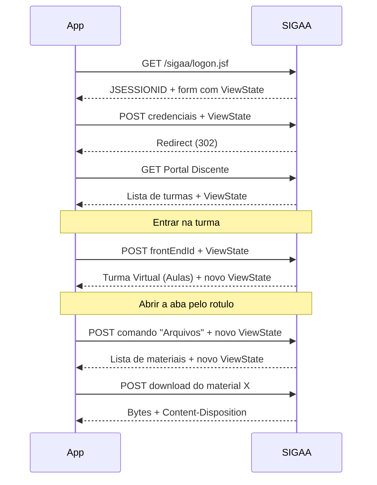
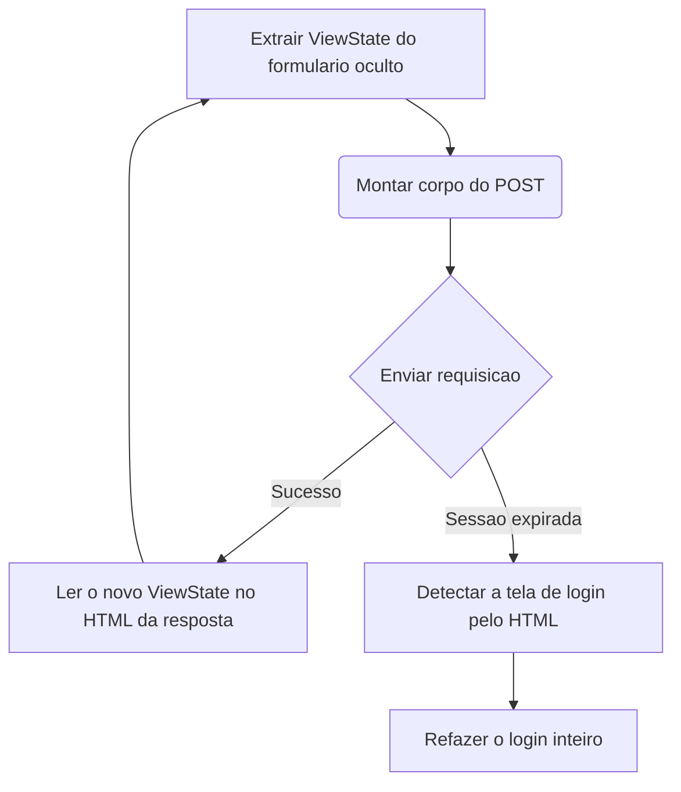

# Referência do protocolo SIGAA

Como o SIGAA funciona por dentro e como este aplicativo conversa com ele.

> Esta página é um resumo de orientação. O registro completo, verificado contra
> o site real e com os trechos de HTML capturados, é o `docs/RECON.md`. Antes de
> mexer em qualquer parser, leia a seção correspondente lá.

## Visão geral

O SIGAA é uma aplicação **JSF (JavaServer Faces)** com **RichFaces**. O estado
da interface mora no servidor, não no cliente. Isso explica quase todas as
esquisitices adiante.

- **ViewState**: cada página carrega um token `javax.faces.ViewState`. Ir para a
  página B só funciona a partir da página A, com o ViewState que A devolveu.
- **Navegação por POST**: em vez de URLs com parâmetros, quase tudo é `POST` na
  mesma URL, submetendo um formulário oculto com o comando JSF.
- **Sessão**: rastreada pelo cookie `JSESSIONID`.

## Conceitos

### Fluxo de login

1. `GET` na página de login.
2. `POST` das credenciais junto dos campos ocultos capturados.
3. Seguir os redirecionamentos.
4. Chegar ao Portal do Discente.

### Navegação de turmas

- O portal lista as turmas do período.
- Para entrar na turma virtual, `POST` com o `frontEndId` da turma (hash de 40
  hex). O `idTurma` numérico **não** serve para isso: ele é usado por
  atualizações e chat.
- A navegação entre abas (Arquivos, Tarefas, Notícias, Fóruns, Ver Notas) usa
  comandos com id gerado pelo JSP, do tipo `formMenu:j_id_jsp_719010821_123`.

> **Navegue pelo rótulo, nunca pelo id do componente.** Esses ids são
> posicionais: mudam quando a instituição recompila a página, e o SIGAA responde
> `200 OK` com a aba errada, sem erro nenhum. Use
> `jsf::findCommandByLabel` (`docs/RECON.md` §1.6.1).

### Download de material

- `POST` no comando do arquivo. A chave é o parâmetro `id` **avulso** do
  `jsfcljs`, não o id do componente ao lado dele.
- O cabeçalho `Content-Disposition` da resposta traz o nome real do arquivo.
- Um material de tópico só é baixável se o `id` dele também aparecer na aba
  Arquivos. Tarefa, fórum e vídeo também são `.item` com ícone e `id`.



### Ciclo do ViewState



`http::SigaaSession::classify()` implementa a detecção: devolve `Portal`,
`TurmaVirtual`, `Login`, `SessaoExpirada` ou `Desconhecida`.

## Armadilhas conhecidas

> [!WARNING]
> Cada item abaixo já custou horas de depuração.

1. **Requisições concorrentes.** Usar o mesmo `JSESSIONID` em requisições
   paralelas invalida o ViewState. O sintoma é cruel: o segundo download volta
   como página de erro, gravada com extensão `.pdf`, e só aparece quando o aluno
   tenta abrir o arquivo. Paralelize **por sessão**, nunca dentro de uma.
2. **Sessão curta.** Expira com cerca de 30 minutos de inatividade. O SIGAA
   informa o tempo restante em um cabeçalho, lido por
   `minutosSessaoRestantes()`.
3. **Erro mascarado de 200.** O SIGAA devolve `200 OK` com uma página de erro ou
   de sessão expirada. Nunca confie só no status.
4. **Download falso.** A resposta pode ser o arquivo ou uma página HTML. Use
   `Response::ehDownload()` antes de gravar bytes no disco.
5. **`textContent` inclui `<script>`.** Todo `.topico-aula` embute o JavaScript
   de drag-and-drop do RichFaces, então o texto do nó vem com
   `var elt = $("formAva:...")` grudado no que o professor escreveu. Use
   `Node::textoVisivel()` em qualquer campo que vá para a tela.
6. **Codificação windows-1252.** O SIGAA não serve UTF-8. O browser decodifica
   sozinho e esconde o problema no DevTools; quem lê os bytes vê `0xC7 0xD5`, que
   é UTF-8 inválido. Converta com `html::toUtf8()` antes de parsear
   (`tests/html_encoding_test.cpp`).
7. **Nome de arquivo em RFC 5987.** O `Content-Disposition` costuma usar
   `filename*=UTF-8''...` quando o professor põe acento no nome.
   `Response::nomeSugerido()` já trata os dois formatos e remove caminho, para
   evitar escrita fora da pasta escolhida.
8. **WAF e rate limiting.** Muitas requisições em pouco tempo acionam o firewall
   da universidade.

## Dados pessoais nas respostas

> [!CAUTION]
> O Portal do Discente traz informação sensível, do usuário e de terceiros, em
> praticamente **todas** as páginas.

As respostas incluem nome completo, CPF (às vezes só no fonte, em chamadas JSF),
matrícula, email institucional e pessoal, `idusuario` do banco do SIGAA, chave
da foto de perfil e o `JSESSIONID`, que permitiria sequestro temporário de
sessão.

**Regra absoluta:**

- **NUNCA** commite `.html` cru do SIGAA no repositório.
- Passe todo HTML capturado por `tools/redact.py` antes de virar fixture. Ele
  troca CPF, nomes, matrícula e afins por valores neutros, e é idempotente, o
  que permite usar `--check` como hook de pre-commit.
- O `.gitignore` bloqueia `tests/fixtures/raw/` e `*.har`. Mantenha o material
  cru lá.

## Como capturar HTML novo

O subcomando `explorar` navega de verdade e grava o HTML cru de cada passo. Ele
existe porque não dá para escrever parser contra página que ninguém leu:

```sh
sigaa-cli explorar <turma> [<aba>] [<dir>]     # padrao dir=recon
```

Depois: `python tools/redact.py` no que foi gravado, e só então o arquivo pode
virar fixture em `tests/fixtures/`.
