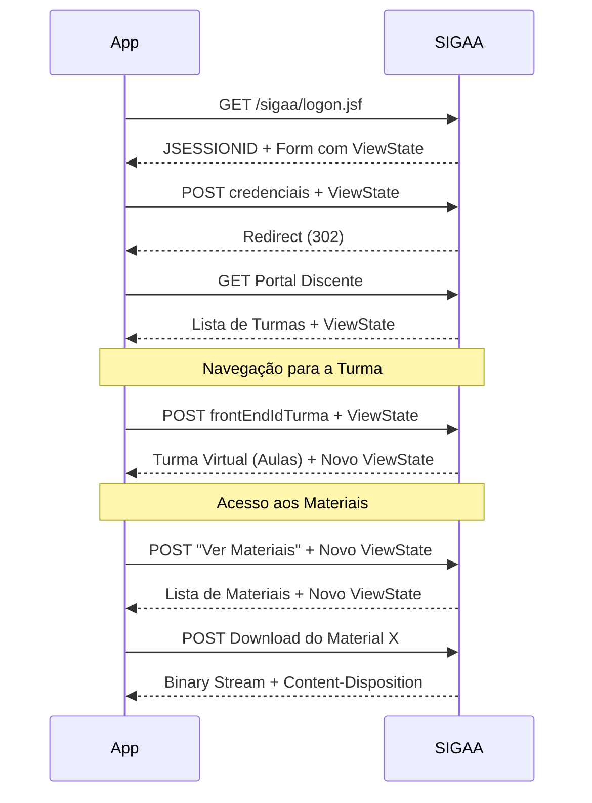
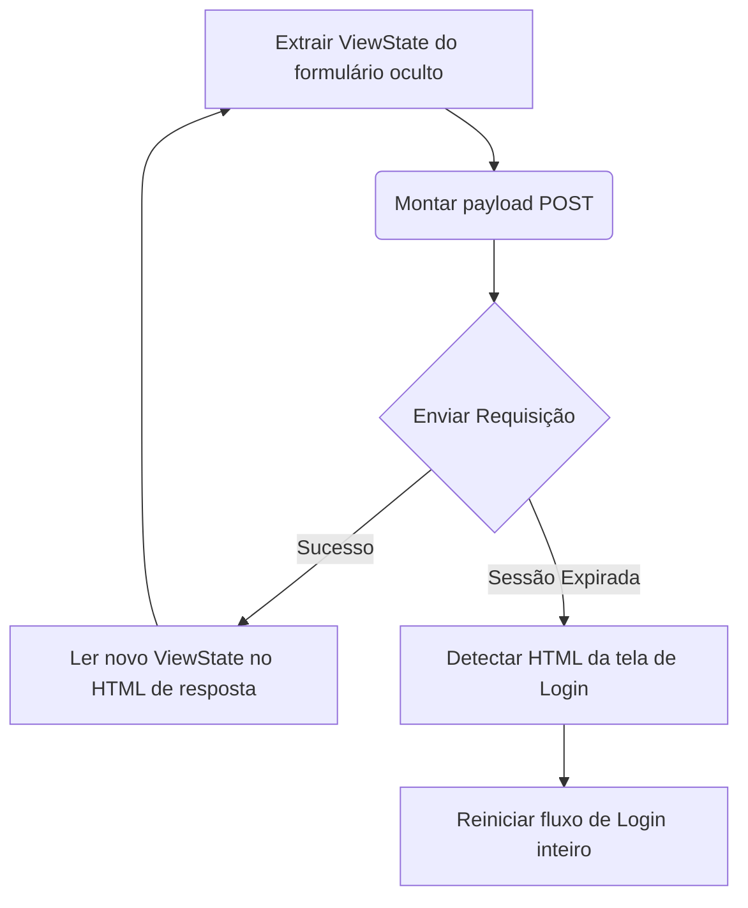

# Referência do Protocolo SIGAA

Esta página destina-se a contribuir para o entendimento técnico de como o SIGAA funciona internamente e como nosso aplicativo interage com ele.

## Visão Geral

O SIGAA é construído sobre a tecnologia **JSF (JavaServer Faces)** juntamente com a biblioteca **RichFaces**. O estado da interface é altamente acoplado ao servidor.

- **Máquina de Estados (ViewState):** Cada transação e navegação depende de um token de estado único. A transição para a página B só funciona se for originada da página A e utilizando o `ViewState` correto.
- **Navegação via POST:** Em vez de depender de URLs específicas (ex: `/sigaa/turma/detalhes.jsp?id=123`), quase toda a navegação é feita via `POST` na mesma URL (ou similar), submetendo comandos JSF de formulários ocultos.
- **Sessão:** A sessão é rastreada de forma clássica via cookie `JSESSIONID`.

## Conceitos Chave

### Fluxo de Login
1. `GET` na página de login inicial.
2. `POST` das credenciais capturando tokens escondidos.
3. Siga os redirecionamentos.
4. Chegue na _home_ do Portal Discente.

### Navegação de Turmas
- O Portal lista as turmas do semestre.
- Para entrar na turma virtual, fazemos um `POST` contendo o `frontEndIdTurma`.
- A navegação entre abas (Aulas, Materiais, Tarefas) usa botões com IDs gerados pelo JSF (ex: `j_id_xx`). Isso é muito frágil. **Preferimos fazer a correspondência com base na label (texto) do link**.

### Download de Material
- Enviar o `POST` para o link do arquivo (ou equivalente).
- O cabeçalho `Content-Disposition` da resposta define o nome real do arquivo.

### Gerenciamento de ViewState e Sessão

O servidor expira sessões (geralmente ~30 min) e perde estados se houver requests simultâneos no mesmo cookie.

## Pegadinhas e Detalhes Importantes (Gotchas)

> [!WARNING]
> Muitas dores de cabeça nasceram destas características.

1. **Requisições Concorrentes:** Usar a mesma `JSESSIONID` em múltiplos requests paraleos em diferentes "abas virtuais" costuma invalidar o token de ViewState. O SIGAA ficará confuso. Evite requests assíncronos pesados na mesma sessão se eles dependerem de estado de página.
2. **Tempo da Sessão:** A sessão expira após ~30 minutos de inatividade.
3. **Erros Mascarados:** O SIGAA muitas vezes retorna código HTTP `200 OK` mas entrega uma página HTML com um erro empacotado na tela ou dizendo que a sessão expirou.
4. **Falsos Downloads:** Ao fazer download, a resposta pode ser um arquivo binário OU uma página HTML avisando que a sessão caiu. Sempre use a lógica `ehDownload()` que verifica o cabeçalho antes de gravar dados.
5. **Scripts Poluindo HTML:** O `RichFaces` injeta grandes blocos de JavaScript direto no documento e dentro de nós inusitados. Nossos parsers de HTML precisam sempre limpar tags `<script>`.
6. **Codificação:** O SIGAA usa Windows-1252, não UTF-8 na maioria das vezes. O aplicativo deve converter a codificação (`transcode`) para lidar corretamente com acentos no Qt e no banco.
7. **Nomes de Arquivo em RFC 5987:** O cabeçalho `Content-Disposition` frequentemente usa o padrão de encoding `filename*=UTF-8''` em vez de um filename simples quando há caracteres especiais no material do professor.
8. **Rate Limiting/WAF:** Muitos requests em curtos intervalos ativam os Web Application Firewalls (WAF) da universidade.

## Dados Sensíveis (PII) nas Respostas

> [!CAUTION]
> O Portal do Discente contém uma quantidade enorme de informações sensíveis do usuário e de terceiros em praticamente **todas** as páginas.

As respostas incluem:
- Nome completo e abreviado
- CPF (às vezes escondido no fonte, mas presente em certas chamadas JSF)
- Matrícula
- Email institucional / pessoal
- `idusuario` do banco de dados do SIGAA
- Chave da foto de perfil
- `JSESSIONID` (que permitiria sequestro de sessão temporário)

**Regra Absoluta:**
- **NUNCA** commite `.html` bruto no repositório ao construir fixtures de teste.
- Use `tools/redact.py` no diretório raiz para limpar e sanitizar completamente os dados (ele usa RegEx para trocar CPFs por `000.000.000-00`, nomes por `ALUNO FULANO`, etc.).
- O arquivo `.gitignore` por padrão bloqueia a pasta `tests/fixtures/raw/` e arquivos `.har`. Mantenha-os lá!
